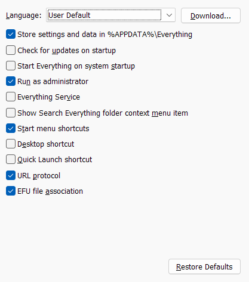

# Configuring Windows 10 / 11

## Install [Scoop](https://scoop.sh)

```bash
scoop install altsnap
scoop install pshazz
scoop install scoop-completion
scoop install scoop-search
scoop install shutup10
```

## Install software using `winget`

```bash
winget install Notepad++.Notepad++
winget install Microsoft.VisualStudioCode
winget install JetBrains.IntelliJIDEA.Community
```

## Install [Roboto Mono Font](https://fonts.google.com/specimen/Roboto+Mono)

## Install [QuickLook](https://github.com/QL-Win/QuickLook/releases/tag/3.7.3) (use `.msi`)

## Install [Everything](https://www.voidtools.com/downloads/)

In `C:\Program Files\Everything\Everything.ini`, ensure that the following settings are applied:

```ini
app_data=1
run_as_admin=1
allow_http_server=0
allow_etp_server=0
```

1. Open Everything
1. Open Settings (Ctrl + P)
1. Go to General
1. Ensure it looks like this:

    

## Windows 11 Settings

- System > Clipboard > Clear clipboard data
- System > For developers > enable "Developer Mode"
- System > For developers > File Explorer > 1 0 1 1 1
- System > For developers > Terminal > Let Windows decide
- System > Multitasking > Show tabs from apps when snapping or pressing alt tab > Don't show
- System > Notifications > (expand first item) > Show notification bell icon
- System > Display > Night light > Enable (strength=50)
- System > Display > Brightness > Change brightness based on content > Off
- System > Display > Scale > 100% or 125%
- System > Power & battery > choose all "Energy recommendations"
- System > Power & battery > Power Mode > Best Power Efficiency
- System > Power & battery > Energy Saver > Always on
- Control Panel > Edit power plan > cancel > Choose what the power buttons do > Show "Hibernate" in Power menu

- Bluetooth & devices > Touchpad > Cursor speed > 5
- Bluetooth & devices > Touchpad > Taps > most sensitive
- Bluetooth & devices > Touchpad > Taps > check all
- Bluetooth & devices > Touchpad > 3-fingers > volume up, volume down, previous track, next track, play/pause
- Bluetooth & devices > Touchpad > 4-fingers > nothing

- Bluetooth & devices > Mouse > Additional mouse settings > Double-click speed 3rd tick from right
- Bluetooth & devices > Mouse > Additional mouse settings > Pointer speed > "e" in "pointer"
- Bluetooth & devices > Mouse > Additional mouse settings > uncheck "Enhance pointer position"

- Control Panel > Keyboard > Repeat delay > Short
- Control Panel > Keyboard > Repeat rate > Fast

- Personalisation > Background > select purple crescent planet
- Personalisation > Colors > Custom mode (windows=dark, app=light)
- Personalisation > Colors > Transparency effects > enable
- Personalisation > Colors > Accent color > Automatic
- Personalisation > Lock screen > select (other) purple crescent planet
- Personalisation > Lock screen > uncheck "Get fun facts, tips, tricks, and more on your lock screen"
- Personalisation > Lock screen > Lock screen status > None
- Personalisation > Lock screen > check "Show the lock screen background picture on the sign-in screen"
- Personalisation > Start > use "More recommendations"
- Personalisation > Start > (everything off)
- Personalisation > Taskbar > hide Search, Task view, Widgets
- Personalisation > Taskbar > Taskbar behaviours > Taskbar alignment > Left
- Personalisation > Taskbar > Taskbar behaviours > check "Show my taskbar on all displays"
- Personalisation > Taskbar > Taskbar behaviours > When using multiple displays, show my taskbar apps on > Taskbar where window is open
- Personalisation > Taskbar > Taskbar behaviours > Select the far corner of the taskbar to show the desktop
- Personalisation > Device usage > (everything off)
- Personalisation > Dynamic Lighting > Use Dynamic Lighting on my devices > Off

- Apps > Startup > disable useless startup apps (alternatively, open Task Manager > Startup apps > disable useless startup apps)

- Time & language > Typing > Autocorrect misspelled words
- Time & language > Typing > Highlight misspelled words
- Time & language > Language & region > Regional format (alternatively, Control Panel > Clock and Regions > Change date, time, or number formats) > add "ddd" to short date
- Time & language > Date & time > Set time zone automatically
- Time & language > Date & time > Set time automatically

- Accessibility > Color filters > open Color filters > select Grayscale
- Accessibility > Color filters > Enable WIN + ctrl + C
- Accessibility > Keyboard > Underline access keys

- Privacy & security > Search permissions > History > disable
- Privacy & security > General > (everything off)

- Windows Update > Advanced Options > Notify me when a restart is required to finish updating

- Task Manager > Processes > sort by Memory in descending order
- Task Manager > Performance > right-click CPU graph and enable "Show kernel times"
- Task Manager > Performance > right-click CPU graph and change graph to "Logical processors"
- Task Manager > Details > sort by name in ascending order
- Task Manager > Services > sort by name in ascending order

## WSL2

In `~/.bashrc`, add the following lines:

```bash
if [ "$TERM_PROGRAM" == "vscode" ]; then
    # fix vscode vim replacing first character in file with 'g'
    export TERM=linux
fi
```

```bash
alias ll='LC_COLLATE=C ls -alF'
```

If WSL2 (with `systemd` enabled) encounters problems with missing files in the `/run/user/1000/` directory:

```bash
# enable linger
sudo loginctl enable-linger $USER

# check linger status
loginctl user-status $USER
```
